# 🏡 Web Scraping and Big Data dynamic data collection and analysis of Airbnb

## 📖 Overview
Analysis and extraction of data from dynamic web pages using the RSelenium library to gather information from Airbnb listings related to Italy. Subsequently, machine learning methods are applied to compare differences between cities and identify the main factors influencing rental prices in different areas. 

## 📂 Data Collection
The datasets used in this project were collected from [InsideAirbnb](https://insideairbnb.com/), which provides publicly available data on Airbnb listings.
The entire process was **automated** using **RSelenium** in R, enabling programmatic browser interaction.

---

### 🔹 Collection process

1. **Environment setup**

   * Installed Java, Selenium Server, and GeckoDriver (required for Firefox).
   * Launched a Firefox instance via `rsDriver()` in RSelenium.

3. **Navigation & City identification**

   * Accessed the *Get the Data* section of InsideAirbnb.
   * Extracted titles (`<h3>` elements) containing the string *Italy* using XPath queries to retrieve the list of Italian cities.

4. **Accessing hidden data**

   * Some tables are only available after interacting with hidden buttons (*showArchivedData*).
   * A custom R function was implemented to automatically click these buttons, making archived datasets accessible.

5. **Dataset download**

   * Created a dedicated folder for each city.
   * Located download links (`.csv` and `.csv.gz`) using XPath, and saved them with filenames that include the corresponding reference date.

6. **Decompression of compressed files**

   * Files in `.csv.gz` format were automatically decompressed with `gunzip()` (from the **R.utils** package) and replaced with their `.csv` versions.

---

### 🔹 Types of collected data

The downloaded datasets from InsideAirbnb include:

* **`listings.csv`** → detailed information on listings (price, property type, location, host, amenities, etc.).
* **`reviews.csv`** → full guest reviews (date, text, listing ID).
* **`neighbourhoods.csv`** → list of neighborhoods in each city.

---

👉 This automated pipeline ensures a **structured, reproducible, and up-to-date data collection process**, enabling systematic analysis of Airbnb activity across multiple Italian cities. ()

---

## 🧼 Data Cleansing
The raw Airbnb datasets were cleaned, transformed, and prepared for analysis to ensure a **consistent, structured, and analyzable dataset**.

### 🔹 Dataset Aggregation

1. **Quarterly listings** were collected (Dec 2023 – Dec 2024) for **10 cities**.
2. City-specific datasets were merged into a single dataset: **824,911 listings × 76 variables**.
3. Added three new variables:

   * **`city`** – identifies the city of the listing
   * **`house_id`** – unique property ID per host (created by analyzing host ID, coordinates, and listing IDs)
   * **`id_period`** – quarterly scraping period (1–4), derived from `last_scraped`

### 🔹 Variable Cleaning & Encoding

1. Removed **irrelevant variables**: descriptive text, URLs, and redundant review-related columns.
2. Kept only `minimum_nights` and `maximum_nights` for nights variables.
3. Converted character variables to **categorical factors**.
4. Cleaned numeric variables:

   * Removed `%` from response/acceptance rates 
   * Removed `$` and `,` from `price`
   * Replaced `_` with `00` in `house_id`
   * Converted all cleaned variables to numeric 
5. Missing values represented as `"N/A"` were converted to `NA`.

---

### 🔹 Handling Missing Data

1. Variables with excessive missing values (e.g., `neighbourhood_group_cleansed`) were removed.
2. Categorical missing values were labeled `"Unknown"`.
3. **Bedrooms**: missing values were extracted from the `name` field → variable `bedrooms_recoded` created.
4. **Bathrooms**: numeric value extracted from `bathrooms_text` (half-baths → `0.5`) → variable `bathrooms_recoded` created.
5. Original `bedrooms`, `bathrooms`, and `bathrooms_text` removed.
6. Skewed or low-quality variables (`host_response_time` and `host_acceptance_rate`) were excluded.

---

### 🔹 Price Processing

1. Removed missing values (54,770 listings) and outliers (`price > $4,000`).
2. Applied **log transformation** to reduce skewness and improve modeling → variable `lp` (log price) created.

---

### 🔹 Recoding Categorical Variables

1. **`property_type`** (137 levels) → `property_type_recoded` with top 4 categories + `Other`.
2. **`host_response_time`**: merged categories `within a day` + `a few days or more` as `more time`.
3. **`room_type`**: merged categories `Hotel room`, `Private room`, `Shared room` as `Private/Shared/Hotel`.
4. Removed listings with `maximum_nights > 1125` or missing review scores.

---

👉 After preprocessing, the dataset is **clean, consistent, and ready for **preliminary analysis**. ()

---

## 📊 Exploratory Data Analysis 
The cleaned Airbnb dataset (**575,542 listings × 30 variables**) was analyzed to explore property characteristics, host attributes, and price dynamics across **10 Italian cities**. 
Initial analyses focused on the most recent quarter, using the latest available prices for all listings.

  
<strong>Property Prices</strong>

    <!-- aggiunge spazio -->
  ### Log Price
  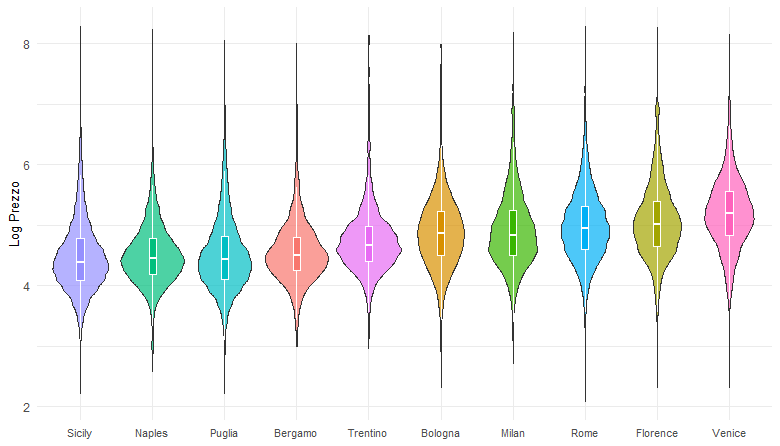

  
<strong>Property attributes</strong>

   

  ### Room Type 
  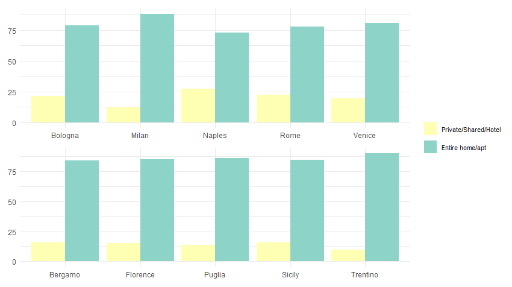

  ### Property Type
  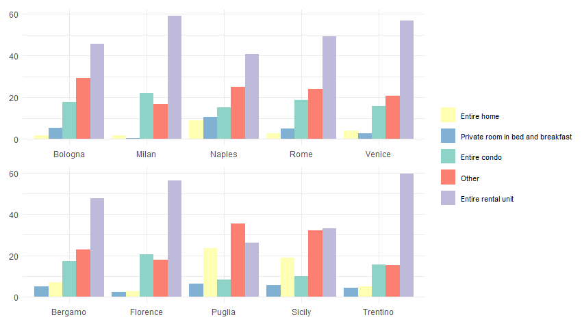

  ### Instant Bookable
  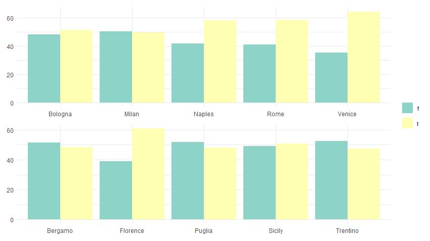

  ### Property Size
  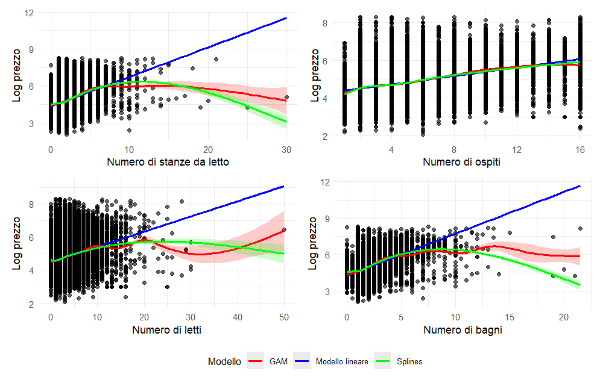

  
<strong>Host features</strong>

   

  ### Host Identity Verified
  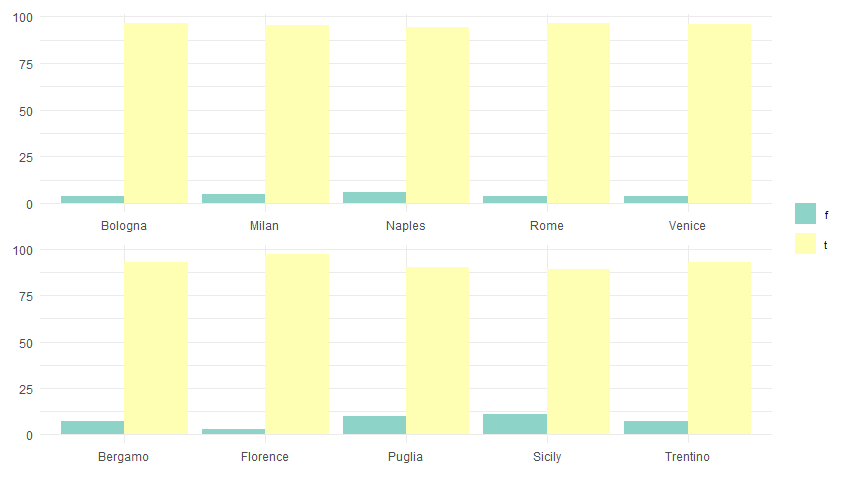

  ### Super Host
  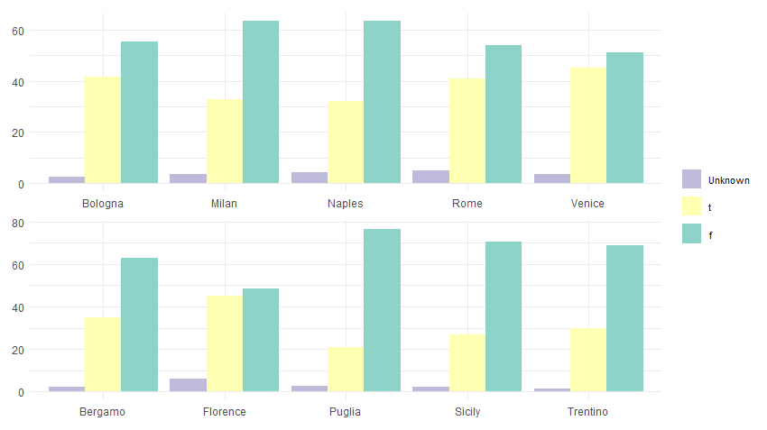

  ### Host Response Time
  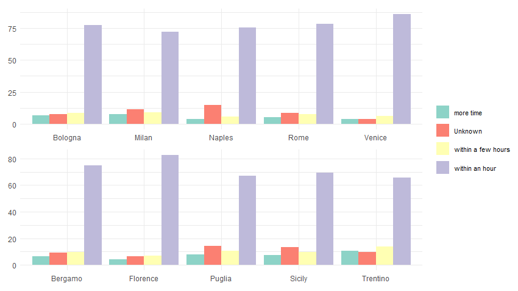

The full dataset is then used to analyze price trends over time, focusing on four major cities: Milan, Venice, Rome, and Naples.

  
<strong>Quarterly Price Analysis</strong>

   

  ### Average Price by City
  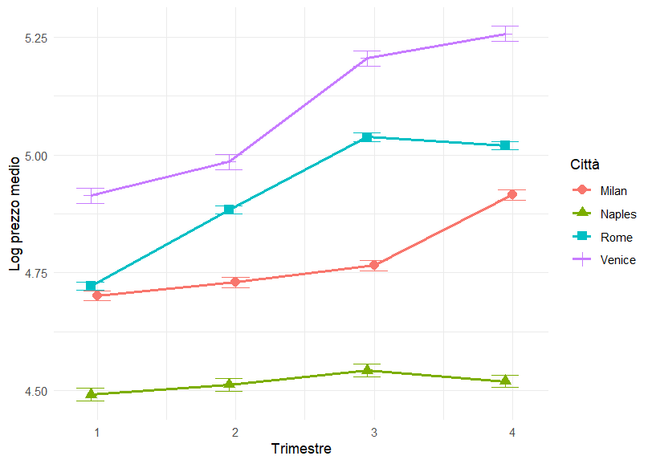

  ### House Prices Across Cities
  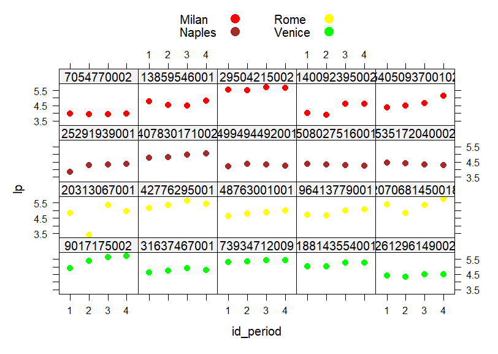

  ### House Prices by Different Hosts 
  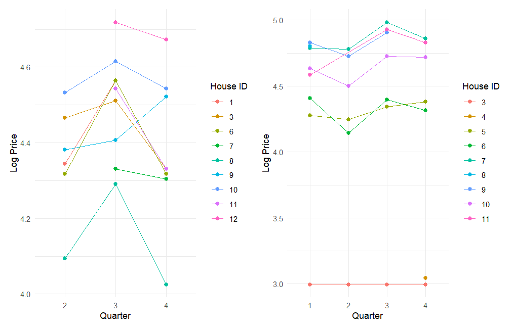

---

👉 The following EDA script reproduces all figures and more analyses for the Airbnb dataset. ()

---

## 🤖 Modeling

## Regression Models
To simplify the models and improve interpretability, unnecessary variables were removed:  
- Dropped: `price` (replaced with log price - `lp`), `id`, `host_id`, `latitude`, `longitude`  
- Kept: `house_id_num`, `id_period` (only for quarterly analysis)  

Models were applied to Milan, Venice, Rome, and Naples, using the latest available scraping data to capture up-to-date prices.  
- **Lasso Regression**
- **Adaptive Lasso Regression**    
- **Adaptive Elastic Net Regression**  
- **Regression Trees**  
- **Random Forest**  

The dataset was split into 70% training and 30% testing to balance variance and bias.  
Evaluation was based on the Mean Squared Prediction Error (MSPE), focusing on the trade-off between interpretability and predictive accuracy. 

---

## Longitudinal Model

  

## 🏆 Results

The main findings from the rental price analysis are:

1. **Key factors**:  
  - Number of bedrooms, bathrooms, and guests  
  - Property type  
  - Review scores  

2. **Predictive models**:  
  - Non-parametric models, especially **Random Forest**, showed the best predictive performance.  

3. **Longitudinal analysis and geographical differences**:  
  - **Naples**: lower average prices with a decreasing trend over time  
  - **Rome**: faster price growth over time  
  - **Venice**: higher-than-average prices with steady growth  

4. **Individual temporal trends**:  
  - Mixed-effects models with random intercept and slope show that price trends vary across properties  
  - Negative correlation between initial price and sensitivity to time: properties with higher initial prices react less to changes, while lower-priced ones show larger variations  

**Conclusion**: Structural factors, temporal dynamics, and geographic characteristics significantly influence rental prices, with substantial heterogeneity among individual properties.

## 💡 Potential Extensions
- Download **`neighbourhoods.geojson`** from [InsideAirbnb](https://insideairbnb.com/), which defines neighborhood boundaries, for spatial analysis.
